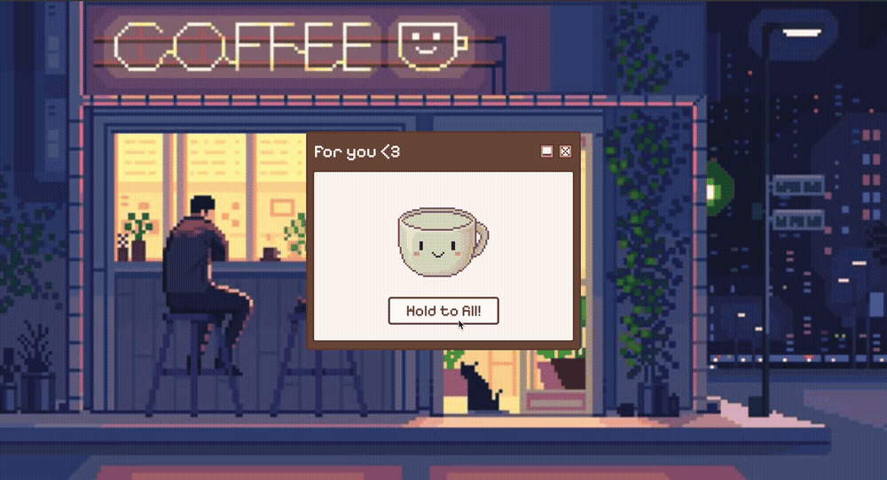

# ☕ Coffee Break

**Coffee Break** is a simple, interactive front-end project that offers a calming animation of coffee filling up when you press and hold a button. It's a lighthearted, visually engaging experience that lets you "take a coffee break" with a fun pixel-art style.



### ★─── ⋆⋅ ★ FEATURES ★ ⋅⋆ ───★
- **Hold-to-fill animation** using a series of progressively filled coffee cup images
- **Minimal UI** with nostalgic pixel-style fonts and soft pastel colors
- ⚠️~~Responsive layout~~ (need to improve responsiveness)
- **Shrink/Expand and Close/Open** container controls for desktop-like behavior

### ★─── ⋆⋅ ★ TECH STACK ★ ⋅⋆ ───★
- **HTML5**
- **CSS3** (with custom properties and responsive design)
- **Vanilla JavaScript** (no frameworks)

### ★─── ⋆⋅ ★ PROJECT STRUCTURE ★ ⋅⋆ ───★
```
├── assets/
│ ├── favicon.png
│ ├── background.jpeg
│ └── image-content/
│ ├── cup-1.png
│ ├── cup-2.png
│ └── ...cup-7.png
├── index.html
├── style.css
├── index.js
└── README.md
```

### ★─── ⋆⋅ ★ FUTURE IMPROVEMENTS ★ ⋅⋆ ───★
- Add **sound effects** for button interaction and completion
- Introduce a **progress bar** or animation timer
- Include **different beverage options** (e.g., tea, hot chocolate).\
- Support **dark mode** toggle
- Optimize for accessibility
- Add **animated steam effects** using CSS or canvas for enhanced realism
- Save progress in **localStorage** so users can return where they left off

### ★─── ⋆⋅ ★ INSPIRATION ★ ⋅⋆ ───★
This project was inspired by and references [nasha-wanich/beginner-tutorial](https://github.com/nasha-wanich/beginner-tutorial).
